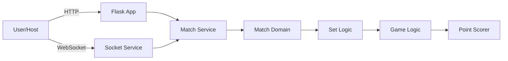
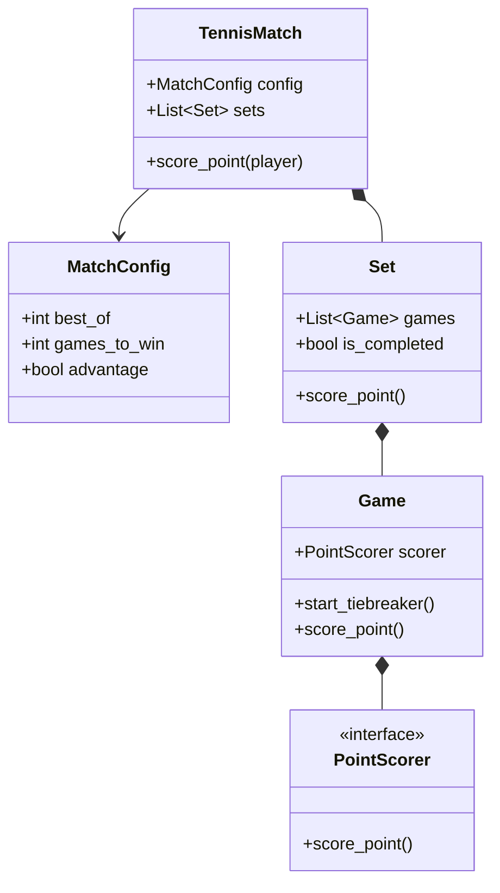

# 🎾 Tennis Scoreboard Application

A broadcast-ready tennis scoreboard application using **Python**, **Flask**, and **Socket.IO**.
Refactored to be modular, testable, and SOLID-compliant.

## Description

This app allows you to display a real-time tennis scoreboard. One client acts as the host (controller) to update scores, while other clients (overlays, spectators) receive updates in real-time. It supports custom player names, set configuration (1, 3, or 5 sets), and full match logic including tie-breakers.

## Features

- **Real-time updates**: Instant score reflection across all connected clients.
- **Configurable**: Change player names, number of sets, and game rules.
- **Robust Logic**: Handles deuce, advantage, tie-breakers, and set transitions automatically.
- **Modular Architecture**: Clean separation of concerns using SOLID principles.

## Installation

1. Clone the repository.
2. Install dependencies:
   ```bash
   pip install -r requirements.txt
   ```

## Usage

### Start the Server
```bash
python src/app.py
```
The server will start on port `5000`.

### Host a Match
1. Open `http://localhost:5000`.
2. Click **Create Match**.
3. Enter player names and match configuration.
4. Click **Start Match**.
5. Use the interface to score points.

### Spectate/Overlay
1. Open `http://localhost:5000/spectate`.
2. The score will update in real-time.

## Architecture

### System Overview


### Domain Model


### SOLID Principles Applied

| Principle | Implementation |
|---|---|
| **S**ingle Responsibility | `PointScorer` for points, `Game` for game rules, `Set` for sets. |
| **O**pen/Closed | Scoring strategies (`AdvantagePointScorer`) can be added without changing core logic. |
| **L**iskov Substitution | `AdvantagePointScorer` and `NoAdvantagePointScorer` are interchangeable. |
| **I**nterface Segregation | `PointScorer` interface is focused only on scoring points. |
| **D**ependency Inversion | High-level `Game` depends on `PointScorer` abstraction, not concrete implementation. |